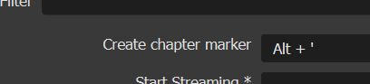
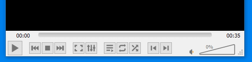

# Chapter Marker

This is a plugin for OBS that lets you add chapters to the video file you are recording which are marked via a hotkey. This is useful when recording videos and you want to mark and highlight an important part of the video thus making it easier to find those moments. Useful for gameplay highlights when recording lengthy videos.

## Building

Use CMake to build the project, change the some of the variable in the `CMakeLists.txt`, i.e.
```cmake
# Hackish CMake variables that were added to finally get this working
set(LIBOBS_LIB "C:/Users/DJ/source/repos/obs-studio/build/libobs/Release")
set(LIBOBS_INCLUDE_DIR "C:/Users/DJ/source/repos/obs-studio/libobs")
set(LibObs_DIR "C:/Users/DJ/source/repos/obs-studio/build/libobs")
set(Qt5_DIR "C:/Users/DJ/source/repos/Qt/5.15.2/msvc2019_64/lib/cmake/Qt5")
set(OBS_FRONTEND_LIB "C:/Users/DJ/source/repos/obs-studio/build/UI/obs-frontend-api/Release/obs-frontend-api.lib")
```

```cmake
F:/code/Visual Studio/Visual Studio Community 2019/obs-studio/build/libobs;F:/code/Visual Studio/Visual Studio Community 2019/obs-studio/build/deps/w32-pthreads;F:/code/Visual Studio/Visual Studio Community 2019/obs-studio/build/UI/obs-frontend-api;F:/code/Visual Studio/Visual Studio Community 2019/obs-deps/lib;F:/code/Visual Studio/Visual Studio Community 2019/obs-deps/include;F:/code/Visual Studio/Visual Studio Community 2019/obs-deps
```

**Note**: The project uses C++17 and the project was forked off [https://github.com/obsproject/obs-plugintemplate](https://github.com/obsproject/obs-plugintemplate).

## Basic Usage

- After install this plugin, a new option "Create chapter marker" will be available (File > Preferences > Hotkeys). Map it to something meaningful to you:
  - 
- Do some recording, invoking this hotkey.
- Open the mkv file created, and search the chapters marks, e.g.:
  - Each chapter will have a number as identification (starting with 1)
  - 
- Markers are displayed differently according to the video player, so, an alternative is to list chapters using `ffprobe -show_chapters <your_video_name.mkv>`.
